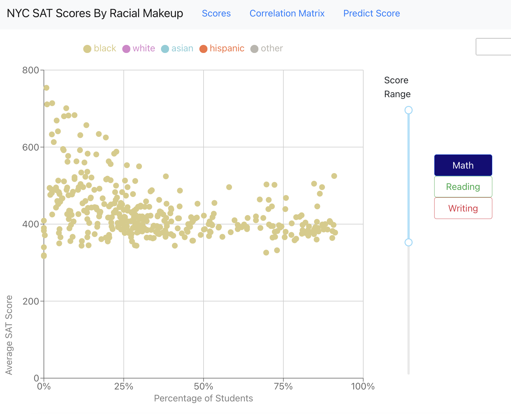

# NYC SAT DATA

## [Model Training Notebook](https://github.com/JordyKieto/NYC-SAT-Scores-Server/blob/master/notebooks/Regression_Notebook.ipynb)

## Goal
I conducted an in-depth analysis of NYC SAT scores and racial demographics, training a predictive model to highlight disparities in the education system.  To empower broader access to these insights, I developed and deployed a full-stack web application where users can input relevant data and receive predicted scores, thereby fostering awareness and informing discussions on educational equity.

## How to Run Locally
### *Prerequisites
* clone [Client App](https://github.com/JordyKieto/NYC-SAT-Scores-Client)
* clone [Server App](https://github.com/JordyKieto/NYC-SAT-Scores-Server)

### *Server
* from the NYC-SAT-Scores-Server directory
* run 
    >pip install -r requirements.txt
* run 
    >start_server.sh
##### __Testing__
* run 
    >pytest
___
### *Client
* from the NYC-SAT-Scores-Client directory
* run 
    >npm install
* run 
    >start_server.sh *host*

### *Database
* Connection String -> Server=localhost;Database=master;Trusted_Connection=True;

## Technologies Used
* Python
* Pandas 
* Flask
* Pytest
* Sqlite3

## Future Updates
* ~~Create a regression model to predict SAT score from demographic makeup, and visualization~~
* ~~Write unit tests for scores route~~
* ~~Replace iterrows with df apply~~
* ~~Remove duplicate data in Filter function~~
* Unit tests for formatScores utility
* Use reduce instead for enumerate for formatScores
* Allow user input of data

## Screenshots

  
  

